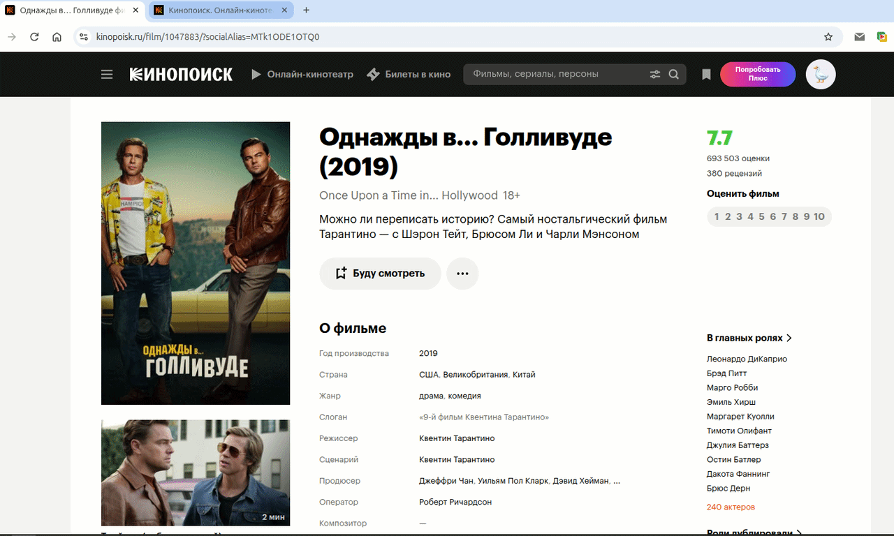
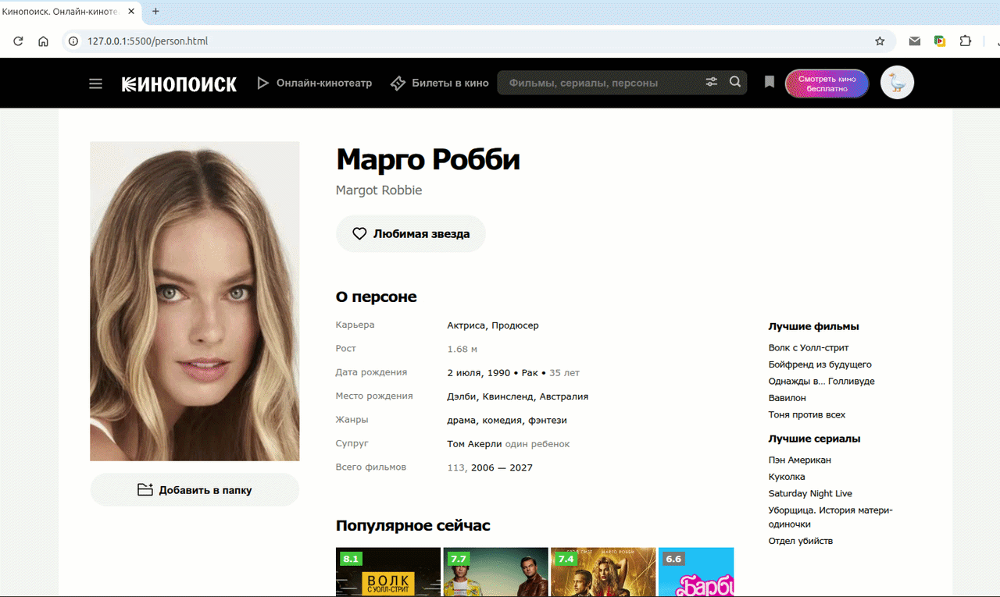

# 🌐 Кинопоиск

> Шаблон сайта kinopoisk.ru

<!-- 🎨 [Посмотреть живой сайт (Live Demo)](ССЫЛКА_НА_GITHUB_PAGES_ИЛИ_VERCEL) -->

---

## 📸 Демонстрация 





## 🛠️ Технологический стек

В данном проекте использовались следующие технологии:

* 🗂️ **HTML5** — семантическая структура и доступность.
* 🎨 **CSS3** — стили, Flexbox/Grid, анимации и адаптивность.
* ⚡ **JavaScript (ES6+)** — интерактивные элементы (меню, слайдеры, валидация).

---

<!-- ## ✨ Особенности проекта

* 📱 **Full Responsive** — сайт корректно отображается на смартфонах, планшетах и ПК.
* ♿ **Семантический HTML** — правильное использование тегов для лучшего SEO.
* 🚀 **Pixel Perfect** — максимальное соответствие исходному дизайн-макету.
* 🌓 **Интерактив** — реализованы [перечислите, например: бургер-меню, модальные окна]. -->

---

## 🚀 Как запустить проект локально

1. Клонируйте репозиторий:
   ```bash
   git clone https://github.com/OlegRemizoff/kinopoisk-template.git
   ```
2. Перейдите в папку с проектом:
   ```bash
   cd kinopoisk-template
   ```
3. Откройте файл `index.html` в вашем браузере (или используйте расширение Live Server в VS Code).


<!-- ## Страница фильма


## Страница Актера


## 💻 Стэк
- **HTML**
- **CSS**
- **JavaScript** -->